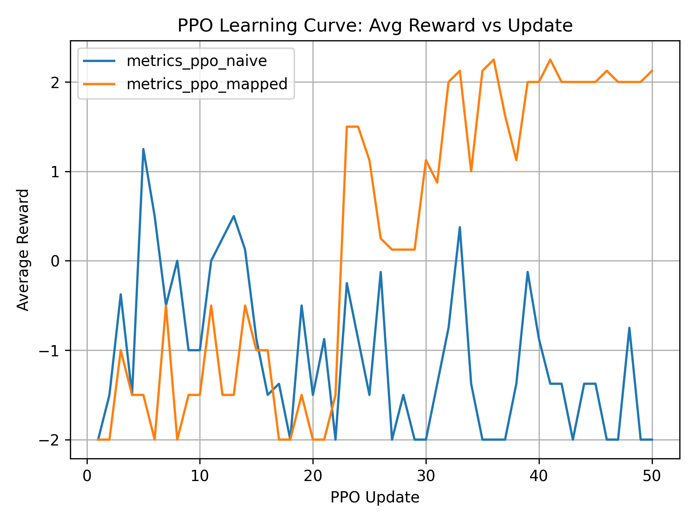
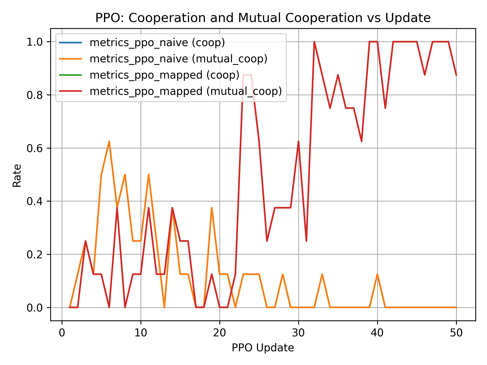
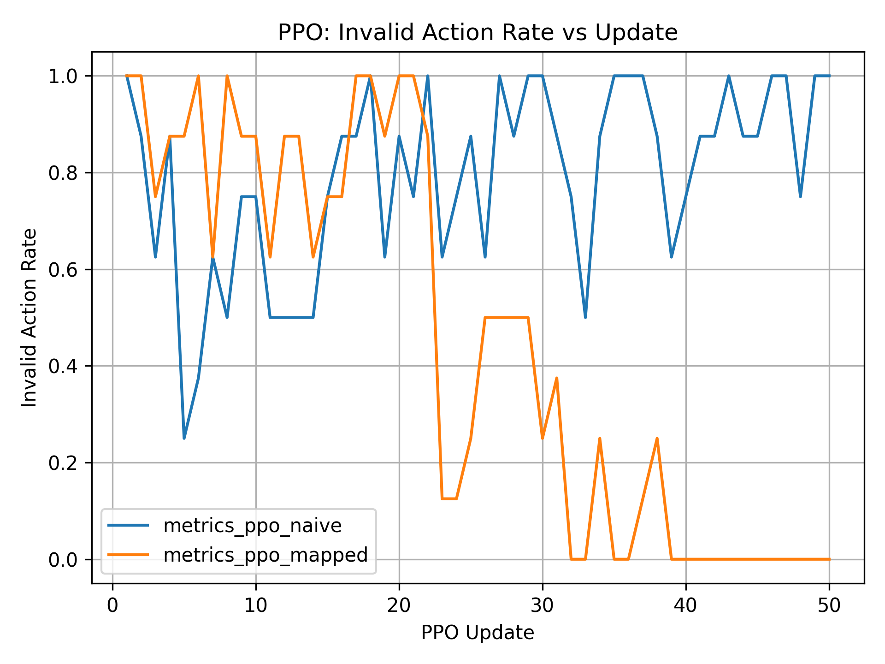
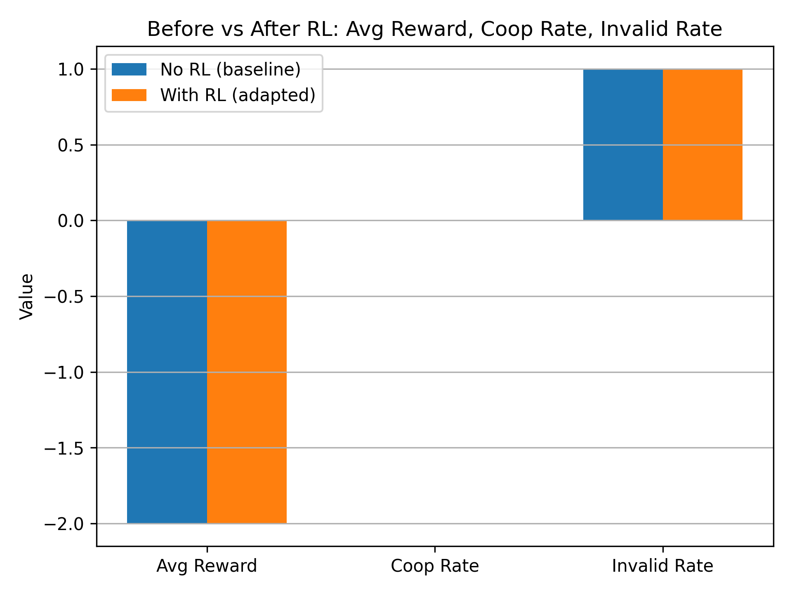

# PPO + LLM: Prisoner's Dilemma Matrix Game

A reinforcement learning research project that applies **Proximal Policy Optimization (PPO)** to fine-tune a large language model (LLM) to play the **Prisoner's Dilemma** — a classic game-theory benchmark for strategic decision making.

---

## Overview

The agent (an LLM) receives a natural-language description of the game state and generates a single token: **C** (cooperate) or **D** (defect). PPO updates the model weights based on the payoff it receives, training it to adopt an optimal strategy against a **tit-for-tat** opponent.

The key research question: *Can PPO successfully train an LLM to learn cooperative behavior in a game-theoretic setting — and how does action-space design affect learning?*

---

## Payoff Matrix

|                  | Opponent: C | Opponent: D |
|------------------|-------------|-------------|
| **Agent: C**     | +2, +2      | -1, +3      |
| **Agent: D**     | +3, -1      |  0,  0      |

Against a tit-for-tat opponent, mutual cooperation (+2 per round) is the optimal long-run strategy.

---

## Project Structure

```
.
├── env.py                        # Prisoner's Dilemma environment (tit-for-tat opponent)
├── rl_llm_matrix_game.py         # Basic PPO training with GPT-2 (50 updates)
├── rl_llm_matrix_game_v2.py      # Full experiment: 3-phase pipeline, naive vs mapped actions
├── plot_matrixgame_metrics.py    # Generate learning curve plots from CSV metrics
├── plot_metrics.py               # Plot metrics from raw training logs
├── main.py                       # Minimal entry point
├── main.ipynb                    # Jupyter notebook
│
├── metrics_no_rl.csv             # Baseline evaluation (untrained model, 500 episodes)
├── metrics_ppo_naive.csv         # Per-update metrics: naive action parsing
├── metrics_ppo_mapped.csv        # Per-update metrics: mapped action parsing
├── metrics_with_rl.csv           # Post-training evaluation (500 episodes)
│
├── training_log.txt              # Console output from training run
├── log_mapped.txt / log_mapped2.txt
│
└── *.png                         # Generated plots (learning curves, before/after bars)
```

> **Model weights** are not included in this repo (too large). Re-run `rl_llm_matrix_game_v2.py` to train from scratch. GPT-2 downloads automatically from HuggingFace.

---

## Key Experiment: Naive vs. Mapped Action Parsing

Two approaches to handling LLM token outputs:

| Approach | Description | Result |
|----------|-------------|--------|
| **Naive** | Only `C`/`D` are valid; all other tokens → invalid (−2 penalty) | ~89% invalid rate; model **never learns** |
| **Mapped** | Any alphabetic token maps deterministically to C/D (even ASCII → C, odd → D) | Converges to full cooperation (~+2 reward) by update 32 |

**Finding:** Forcing action validity is critical. Without it, the penalty signal is too noisy for the model to discover the game structure.

---

## Training Pipeline (`rl_llm_matrix_game_v2.py`)

1. **Baseline Evaluation** — Test untrained model on 500 episodes; save to `metrics_no_rl.csv`
2. **PPO Training** — 100 updates, batch size 4; log per-update metrics to CSV
3. **Post-RL Evaluation** — Test trained model on 500 episodes; save to `metrics_with_rl.csv`

### Configuration

```python
USE_MAPPED_ACTIONS = True           # Toggle naive / mapped action parsing
model_name = "gpt2"                 # Or "mistralai/Mistral-7B-Instruct-v0.2"
num_updates = 100
PPOConfig(learning_rate=1e-5, batch_size=4, mini_batch_size=2, target_kl=0.05)
```

---

## Results






---

## Requirements

```bash
pip install torch transformers trl pandas matplotlib numpy
```

A CUDA-capable GPU is recommended (especially for Mistral-7B). GPT-2 runs on CPU.

---

## Running

```bash
# Train (edit USE_MAPPED_ACTIONS and model_name in the script first)
python rl_llm_matrix_game_v2.py

# Plot results
python plot_matrixgame_metrics.py
```

---

## Tech Stack

- **PyTorch** — deep learning framework
- **HuggingFace Transformers** — GPT-2 / Mistral-7B models
- **TRL** — PPO trainer for language models
- **Pandas / Matplotlib / NumPy** — metrics and visualization
